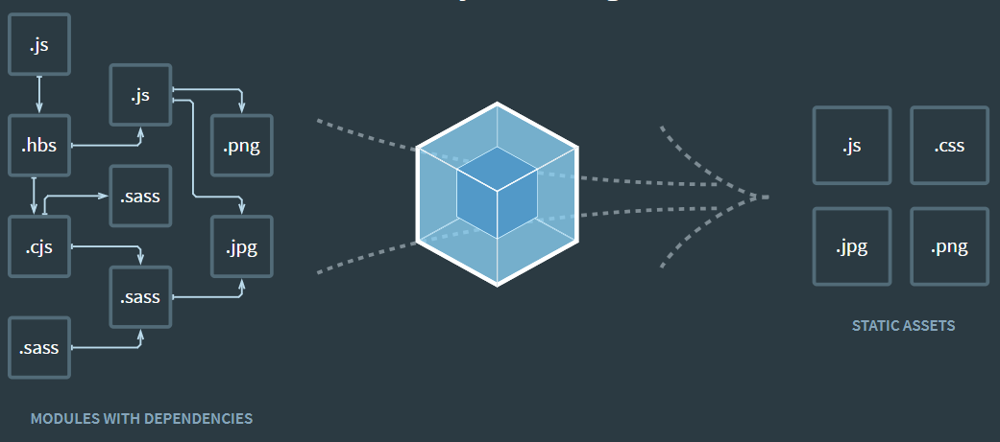

## 2장 JSX
### 2.1 코드 이해하기
  - 웹팩(번들러) 활용
    - 모듈 로딩
    - 파일 로더 기능 지원(이미지,CSS 등)
    - 바벨을 활용한 자바스크립트 버전 문법 변경
    - 
  - create-react-app을 통해 프로젝트를 만들면 기본 설정되어 있음
### 2.2 JSX란?
  - 자바스크립트의 확장 문법
  - 바벨을 사용하여 일반 자바스크립트 형태의 코드로 변환
  - JSX 예제
    ``` 
    function App() {
      return (
        <div>
          Hello <b>react</b>
        </div>
      )
    }
    ```
  - 자바스크립트 변환
    ```
    function App() {
      return React.createElement(
        "div", 
        null, 
        "Hello", 
        React.createElement("b", null, "react)
      );
    }
    ```
### 2.3 JSX의 장점
#### 2.3.1 보기 쉽고 익숙하다
#### 2.3.2 더욱 높은 활용도
  - HTML 태그와 새로 만들 컴포넌트도 JSX안에 작성 가능
    ```
    // index.js
    ReactDOM.render(
      <App />, // 렌더링할 내용
      document.getElementById('root') // JSX를 렌더링할 document 내부 요소
    );
    ```
### 2.4 JSX 문법
#### 2.4.1 감싸인 요소
  - 여러 요소가 있다면 반드시 부모 요소 하나로 감사야 함
  - 컴포넌트 내부는 하나의 DOM 트리 구조로 이뤄짐
#### 2.4.2 자바스크립트 표현
  - JSX 내부에서 자바스크립트 코드를 {}로 감쌈
    ```
    function App() {
      const name = 'react';
      return (
        <>
          <h1>{name} hello!</h1>
          <h2>good job</h2>
        </>
      );
    }
    export defautl App;
    ```
#### 2.4.3 if문 대신 조건부 연산자
  - JSX 내부의 자바스크립트 표현식에서 if문을 사용할 수 없음
    - JSX 밖에서 if문을 사용하여 사전에 값을 설정
      ```
      function App() {
        const name = 'react';
        const result = name === 'react' ? 
          (<h1>react!!</h1>) 
          : 
          (<h1>not react!!</h1>);
        return (
          <div>
            {result}
          </div>
        )
      }
      ```
    - {}안에 조건부 연산자(삼항연산자) 사용
      ```
      function App() {
        const name = 'react';
        return (
          <div>
            {
              name==='react' ? 
              (<h1>react!!</h1>) 
              : 
              (<h1>not react!!</h1>) 
            }
          </div>
        )
      }
      ```
#### 2.4.4 AND 연산자(&&)를 사용한 조건부 렌더링
  - 0을 제외한 falsy 한 값을 리턴하면 아무것도 렌더링 하지 않음
    ```
    function App() {
      const name = 'react';
      return <div>{name === 'react' && <h1>react!!</h1>}</div>;
    }
    ```
#### 2.4.5 undefined를 렌더링하지 않기
  - undefined 리턴시 에러 발생
    ```
    function app() {
      const name = undefined;
      return name;
    }
    ```
  - ||를 사용하여 undefined를 렌더링하지 않기
    ```
    function App() {
      const name = undefined;
      return name || 'name is undefined';
    }
    ```
  - JSX 내부에서는 undefined를 렌더링해도 괜찮음
    ```
    function App() {
      const name = undefined;
      return <div>{name}</div>;
    }
    ```
#### 2.4.6 인라인 스타일링
  - DOM 요소에 스타일을 적용할 때는 문자열 형태가 아니라 객체 형태로 적용
  - 카멜 표기법으로 작성
    ```
    function App() {
      const name = 'react';
      const style = {
        backgroundColor: 'black',
        color: 'aqua'
      };
      return <div style={style}>{name}</div>
    }
    ```
    ```
    function App() {
      const name = 'react';
      return <div style={{
        backgroundColor: 'black',
        color: 'aqua'}}
      >{name}</div>
    }
    ```
#### 2.4.7 class 대신 className
  - css class 사용시 class 대신 className으로 설정
    ```
    function App() {
      const name = 'react';
      return <div className="react">{name}</div>
    }
    ```
#### 2.4.8 꼭 닫아야 하는 태그
  - html은 input 태그를 안 닫아도 동작하나 jsx는 에러
    - self closing으로 닫아도 됨
      ```
      <input />
      ```
#### 2.4.9 주석
  - {/* ... */} 형식으로 작성
### 2.5 ESLint와 Prettier 적용하기
#### 2.5.1 ESLint
  - 문법 검사 도구
#### 2.5.2 Prettier
  - 코드 스타일 자동 정리 도구
### 2.6 정리