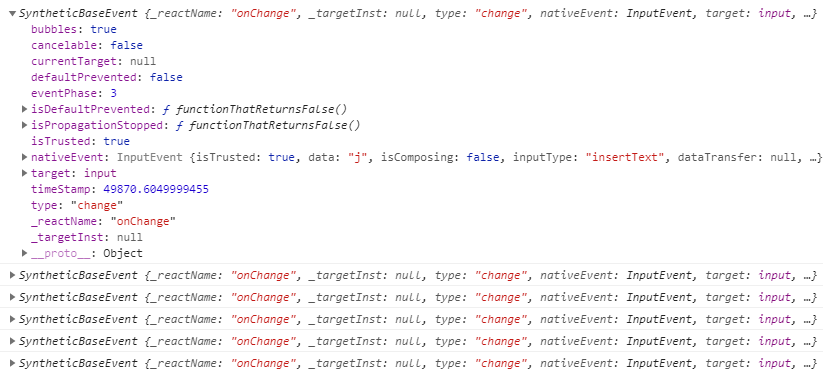

## 4장 이벤트 핸들링
  - 이벤트 : 사용자가 웹 브라우저에서 DOM 요소들과 상호 작용하는 것
### 4.1 리액트의 이벤트 시스템
#### 4.1.1 이벤트를 사용할 때 주의 사항
  - 이벤트 이름은 카멜 표기법으로 작성
  - 함수 형태의 값 전달
  - DOM 요소에는 이벤트를 설정할 수 있지만, 우리가 직접 만든 컴포넌트에는 이벤트를 설정할 수 없음
    ```
    <MyComponent onClick={doSomething} />
    ```
    - MyComponent의 props로 전달
    - 전달 받은 props를 통해 DOM요소에 이벤트 설정은 가능
      ```
      <div onClick={this.props.onClick}>
        { /* (...) */ }
      </div>
      ```
#### 4.1.2 이벤트 종류
  - [공식홈페이지 링크](https://reactjs.org/docs/events.html)
    - Clipboard
    - Composition
    - Keyboard
    - Focus
    - Form
    - Generic
    - Mouse
    - Pointer
    - Selection
    - Touch
    - UI
    - Wheel
    - Media
    - Image
    - Animation
    - Transition
    - ...
### 4.2 예제로 이벤트 핸들링 익히기
#### 4.2.1 컴프넌트 생성 및 불러오기
  - 컴포넌트 클래스 생성
  ```
  class EventPractice extends Component{
    render() {
      return (
        <div>
          <h1>event practice</h1>
          <input
            type="text"
            name="message"
            placeholder="any input.."
            onChange={
              (e) => {
                console.log(e);
              }
            } 
          />
        </div>
      )
    }
  }
  ```
#### 4.2.2 onChange 이벤트 핸들링하기
  - 
  - SyntheticEvent
    - 웹브라우저의 네이티브 이벤트를 감싸는 객체
    - 이벤트가 끝나고 나면 이벤트 초기화되어 정보를 참조할 수 없음
    - 비동기적으로 이벤트 객체를 참조해야 할 경우 e.persist() 함수를 호출해야 함
#### 4.2.3 임의 메서드 만들기
  - 함수가 호출될때 this는 호출부에 따라 결정
  - 클래스의 임의 메서드가 특정 HTML 요소의 이벤트로 등록되는 과정에서 this의 관계가 끊어짐
  - 메서드를 this와 바인딩 하는 과정 필요
    ```
    constructor(props) {
      super(props);
      this.handleChange = this.handleChange.bind(this);
      this.handleClick = this.handleClick.bind(this);
    }

    handleChange(e) {
      this.setState({message: e.target.value});
    }

    handleClick() {
      alert(this.state.message);
      this.setState({message: ''});
    }
    ```
#### 4.2.4 input 여러개 다루기
  - 객체 안에서 key를 []로 감싸면 그 안에 넣은 레퍼런스가 가리키는 실제 값이 key값으로 사용됨
    ```
    handleChange(e) {
      this.setState({[e.target.name]: e.target.value});
    }
    ```
#### 4.2.5 onKeyPress 이벤트 핸들링
  - Enter Key 이벤트 핸들링
    ```
    handleKeyPress(e) {
      if(e.key === 'Enter') {
        this.handleClick();
      }
    }
    ```
### 4.3 함수형 컴포넌트로 구현해 보기
  - 함수형 컴포넌트 구현
    ```
    const EventPractice = () => {
      const [form, setForm] = useState({
        username: '',
        message: ''
      });
      const { username, message } = form;
      const onChange = e=> {
        setForm({
          ...form,
          [e.target.name]: e.target.value
        });
      };
      const onClick = () => {
        alert( username + ' : ' + message );
        setForm({
          username: '',
          message: ''
        });
      };
      const onKeyPress = e=> {
        if(e.key === 'Enter') {
          onClick();
        }
      };
      return (
        <div>
          <h1>event practice</h1>
          <input 
            type="text"
            name="username"
            placeholder="username"
            value={form.username}
            onChange={onChange}
          />
          <input
            type="text"
            name="message"
            placeholder="input message.."
            value={form.message}
            onChange={onChange}
            onKeyPress={onKeyPress} 
          />
          <button onClick={onClick}>confirm</button>

        </div>
      )
    }
    ```
### 4.4 정리