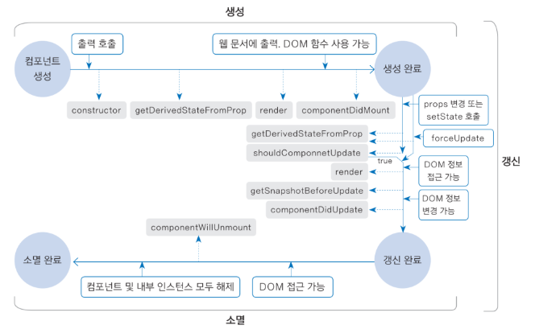

## 7장 컴포넌트의 라이프사이클 메서드
### 7.1 라이프사이클 메서드의 이해
  - 라이프사이클은 마운트, 업데이트, 언마운트 카테고리로 나눔
  - 마운트
    - DOM이 생성되고 웹 브라우저상 나타나는 것

  - 업데이트
    - props가 바뀔 때
    - state가 바뀔 때
    - 부모 컴포넌트가 리렌더링될 때
    - this.forceUpdate로 강제로 렌더링을 트리거할 때
  - 언마운트
    - 컴포넌트를 DOM에서 제거하는 것
  - 
### 7.2 라이프사이클 메서드 살펴보기
#### 7.2.1 render() 함수
#### 7.2.2 constructor 메서드
#### 7.2.3 getDerivedStateFromProps 메서드
#### 7.2.4 componentDidMount 메서드
#### 7.2.5 shouldComponentUpdate 메서드
#### 7.2.6 getSnapshotBeforeUpdate 메서드
#### 7.2.7 componentDidUpdate 메서드
#### 7.2.8 componentWillUnmount 메서드
#### 7.2.9 componentDidCatch 메서드
### 7.3 라이프사이클 메서드 사용하기
#### 7.3.1 예제 컴포넌트 생성
#### 7.3.2 App 컴포넌트에서 예제 컴포넌트 사용
#### 7.3.3 에러 잡아내기
### 7.4 정리